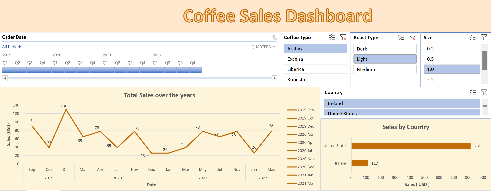
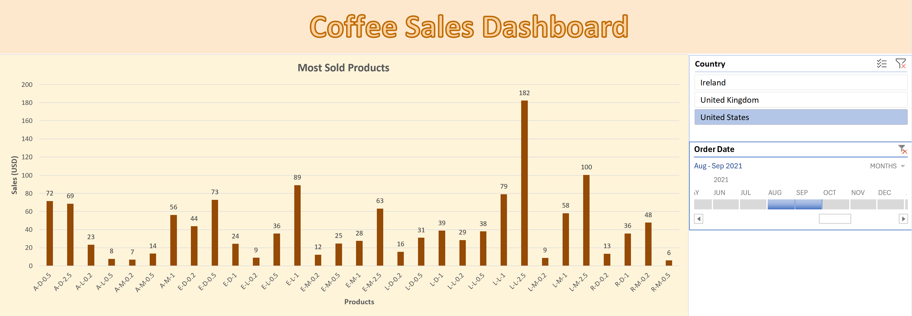

# Coffee Sales Dashboard (Excel)

## Overview
An Excel dashboard designed to track coffee sales performance. It highlights top products, revenue growth, and customer trends across regions and time periods.

## Features
- Interactive filters by country, product, and time period  
- Revenue trends and growth rate visualization  
- Top-selling products and regional performance analysis  

## Tech Stack
- Microsoft Excel (Pivot Tables, Charts, Slicers)

## How to Run
1. Download the Excel file  
2. Enable editing  
3. Explore coffee sales insights through filters and slicers  

## Learning / Takeaways
This project strengthened my skills in sales analytics and dashboard design, helping me understand how to present business KPIs effectively.

# Dashboard Screenshots

